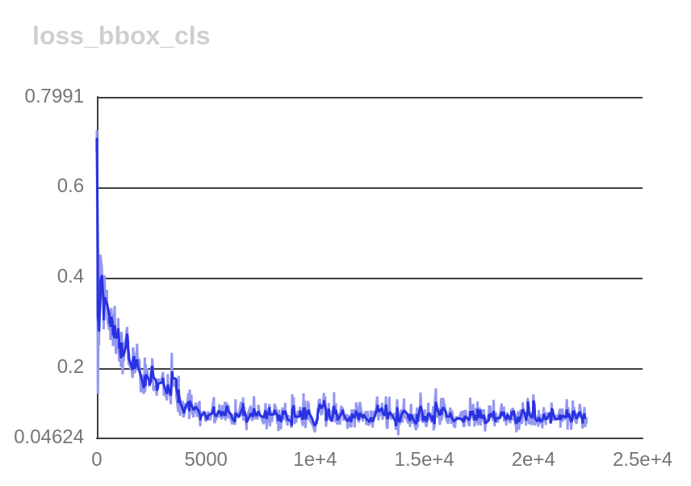
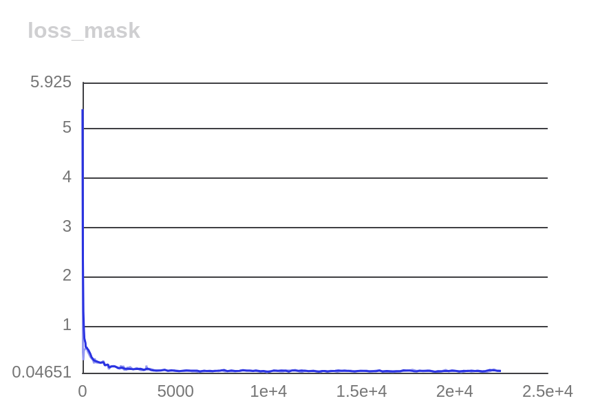
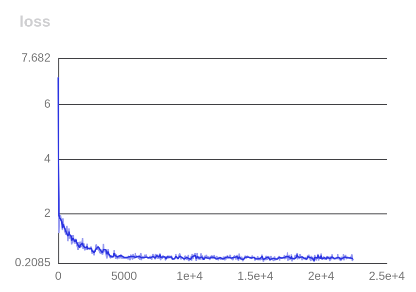
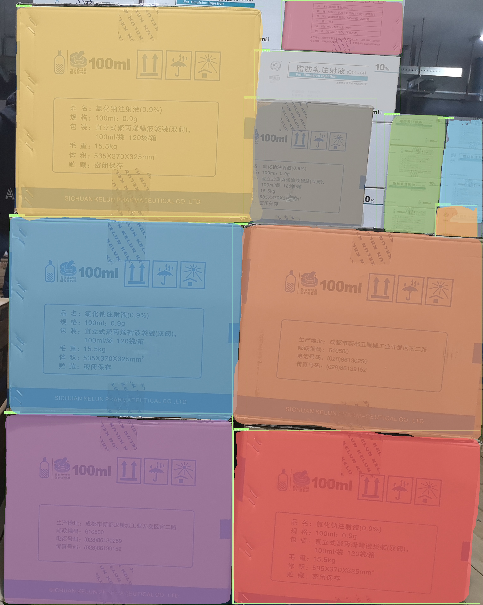
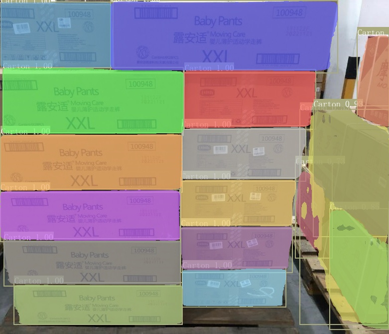
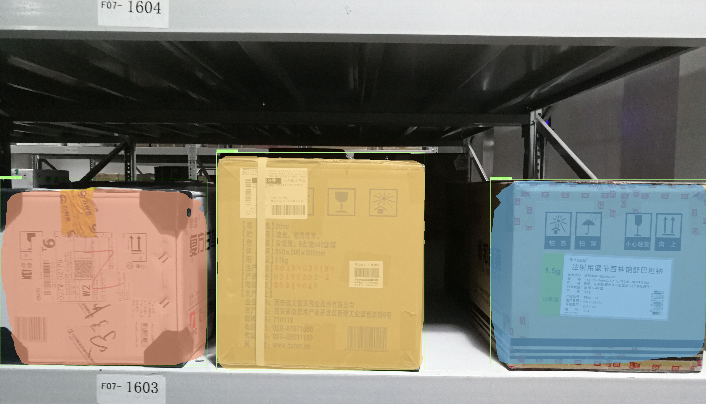
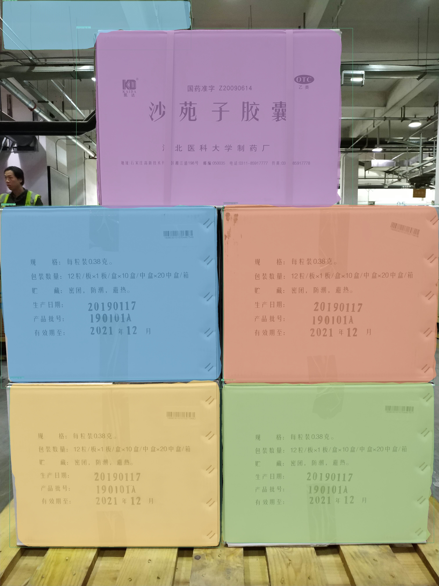
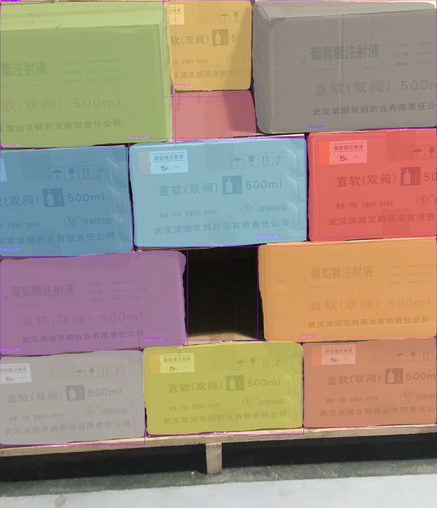

[Official README of Paddle Detection](README_en.md)

# Carton Instance Segmentation using PaddleDetection

This is a custom README to replicate the training and inference pipeline for carton instance segmentation using PaddleDetection. The model I trained with is `MaskRCNN` with `ResNet50` backbone. I used the Stacked Carton Dataset(SCD) given in the task sheet.

**NOTE:** Due to the limited availability of GPU resources, I used 500 images for training and 100 images fr validation/inference. 

# Some important notes

- In the task sheet, it was given that I need to 'detect and segment boxes' thus I chose Instance Segmentation as the task. I have a good hands on with semantic segmentation but I thought it would be better to use instance segmentation as it is more aligned with the task.

- Also, I did not use `YOLO` models as it is already proven and also easy to train.

# Environment Setup

## Requirements:

- PaddlePaddle 2.2
- OS 64 bit
- Python 3(3.5.1+/3.6/3.7/3.8/3.9/3.10)，64 bit
- pip/pip3(9.0.1+), 64 bit
- CUDA >= 10.2
- cuDNN >= 7.6

### 1. Install PaddlePaddle inside a conda environment

```

conda create -n paddle_env python=YOUR_PY_VER

```

```
conda activate paddle_env
```

Now install PaddlePaddle using the following command:
```
# CUDA12.6
conda install paddlepaddle-gpu==3.0.0 paddlepaddle-cuda=12.6 -c paddle -c nvidia
```

```
# CUDA11.8
conda install paddlepaddle-gpu==3.0.0 paddlepaddle-cuda=11.8 -c paddle -c nvidia

```

Please make sure that your PaddlePaddle is installed successfully and the version is not lower than the required version. Use the following command to verify.

```
# check
>>> import paddle
>>> paddle.utils.run_check()

# confirm the paddle's version
python -c "import paddle; print(paddle.__version__)"
```

### 2. Install PaddleDetection


**Note:** Installing via pip only supports Python3

```

# Clone PaddleDetection repository
cd <path/to/clone/PaddleDetection>
git clone https://github.com/snachi2s/pose_estimation.git

# Install other dependencies
cd pose_estimation
git checkout detection
pip install -r requirements.txt

# Compile and install paddledet
python setup.py install

```

**Note**

1. If you are working on Windows OS, `pycocotools` installing may failed because of the origin version of cocoapi does not support windows, another version can be used used which only supports Python3:

    ```pip install git+https://github.com/philferriere/cocoapi.git#subdirectory=PythonAPI```

2. If you are using Python <= 3.6, `pycocotools` installing may failed with error like `distutils.errors.DistutilsError: Could not find suitable distribution for Requirement.parse('cython>=0.27.3')`, please install `cython` firstly, for example `pip install cython`

After installation, make sure the tests pass:

```shell
python ppdet/modeling/tests/test_architectures.py
```

If the tests are passed, the following information will be prompted:

```
.......
----------------------------------------------------------------------
Ran 7 tests in 12.816s
OK
```

# Dataset Preparation

For training, the dataset is to be expected in COCO format. The directory structure should look like this:

```
dataset/coco/     #already created when you clone the repository
├── annotations
│   ├── instances_train2017.json
│   └── instances_val2017.json
└── images
    ├── train2017
    │   ├── 00c12.jpg
    │   ├── 1003.jpg
    │   ├── 1069.jpg
    │   ├── 
    └── val2017
        ├── 101.jpg
        ├── 1028.jpg
        ├── .....
```

And the `instances_train2017.json` and `instances_val2017.json` files should have the following fields in json,
`['image', 'gt_bbox', 'gt_class', 'gt_poly', 'is_crowd']` and not the newer format of `['image_id', 'category_id', 'bbox', 'area', 'iscrowd', 'segmentation']`.

Incase you have the dataset in the newer format, you can convert it to the older format using the `coco_old_format.py` script provided in the repository.
```python
python coco_old_format.py --input_json=dataset/coco/annotations/instances_train2017.json --output_json=dataset/coco/annotations/instances_train2017.json
```

# Training

Use the following command to train the maskrcnn model with resnet50 backbone.

```python
# Train the model
python tools/train.py -c configs/mask_rcnn/carton_mask_rcnn_r50_1x.yml --use_vdl True
```
Trained model are stored in the `output` directory. `model_final.pdparams` is the final model after training.

# Inference
To run inference on a single image, use the following command:

```python

python tools/infer.py -c configs/mask_rcnn/carton_mask_rcnn_r50_1x.yml -o use_gpu=True weights=<output/model_final.pdparams> --infer_img=<input_image> --use_vdl=True --do_eval=False --save_results=True
```

**NOTE:** Since the task is minimal,  I did not convert the model to ONNX or tensorRT  format.

# Training logs





# Model Predictions
### output 1

### output 2

### output 3

### output 4

### output 5

